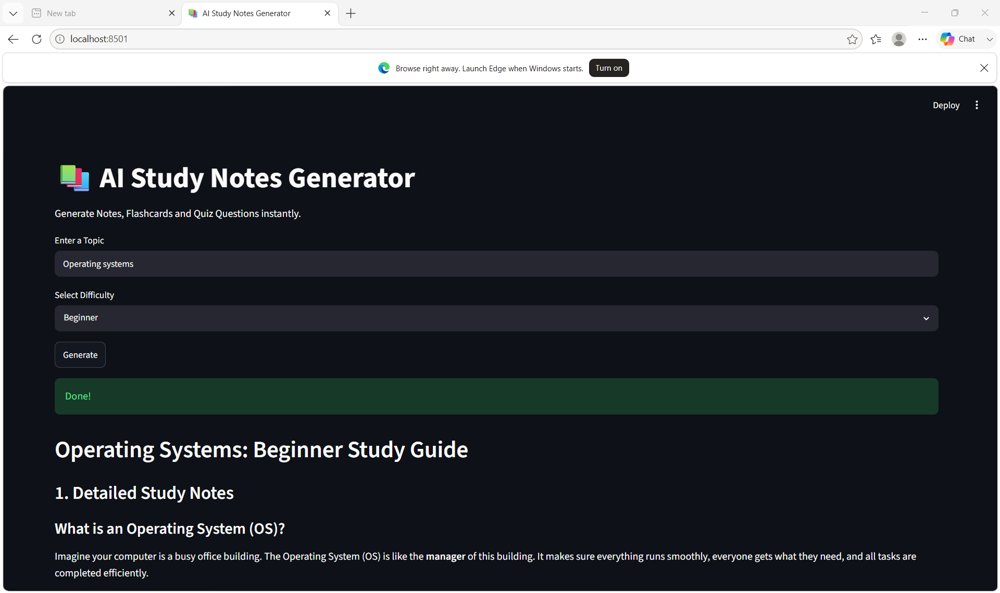

# 📚 AI Study Notes Generator

An AI-powered study assistant that instantly generates **Study Notes**, **Flashcards**, and **Quiz Questions** on any topic — built with Python, Streamlit, and Google Gemini AI.

---

## ✨ Features

- 📝 **Detailed Study Notes** — Comprehensive notes tailored to your chosen difficulty level
- 🔑 **Key Concepts** — Highlights the most important ideas at a glance
- 🃏 **Flashcards** — 5 Q&A flashcards for quick memorization
- ❓ **MCQ Quiz** — 5 Multiple Choice Questions with answers to test yourself
- ⚡ **Quick Revision Summary** — A short recap to review before exams
- 📥 **Download Notes** — Save everything as a `.txt` file instantly

---

## 🛠️ Tech Stack

| Tool | Purpose |
|------|---------|
| Python | Core language |
| Streamlit | Web app framework |
| Google Gemini AI | AI content generation |

---

## 🚀Getting Started

### 1. Clone the repository

```bash
git clone https://github.com/Meroma17/ai-study-notes-generator.git
cd ai-study-notes-generator
```

### 2. Install dependencies

```bash
pip install -r requirements.txt
```

### 3. Set up your Gemini API Key

Create a `.streamlit/secrets.toml` file in the project root:

```toml
GEMINI_API_KEY = "your-gemini-api-key-here"
```

> 🔑 Get your free API key at [Google AI Studio](https://aistudio.google.com/)

### 4. Run the app

```bash
streamlit run app.py
```

Then open your browser at `http://localhost:8501`

---

## 📁 Project Structure

```
ai-study-notes-generator/
│
├── app.py                  # Main Streamlit app
├── requirements.txt        # Python dependencies
├── .gitignore              # Excludes secrets and cache
└── README.md               # Project documentation
```

---

## 🌐 Live Demo

> Deploy your own in minutes on **Streamlit Community Cloud**:
> 1. Push this repo to GitHub
> 2. Go to [share.streamlit.io](https://share.streamlit.io)
> 3. Connect your repo and add your `GEMINI_API_KEY` in the Secrets settings
> 4. Click **Deploy** 🎉

---

## 📸 Screenshot



---

## 📄 License

This project is open source and available under the [MIT License](LICENSE).

---

## 🙌 Acknowledgements

- [Google Gemini AI](https://deepmind.google/technologies/gemini/) for the powerful language model
- [Streamlit](https://streamlit.io/) for the easy-to-use web framework

---

*Built with ❤️ using Python, Streamlit and Gemini AI*
